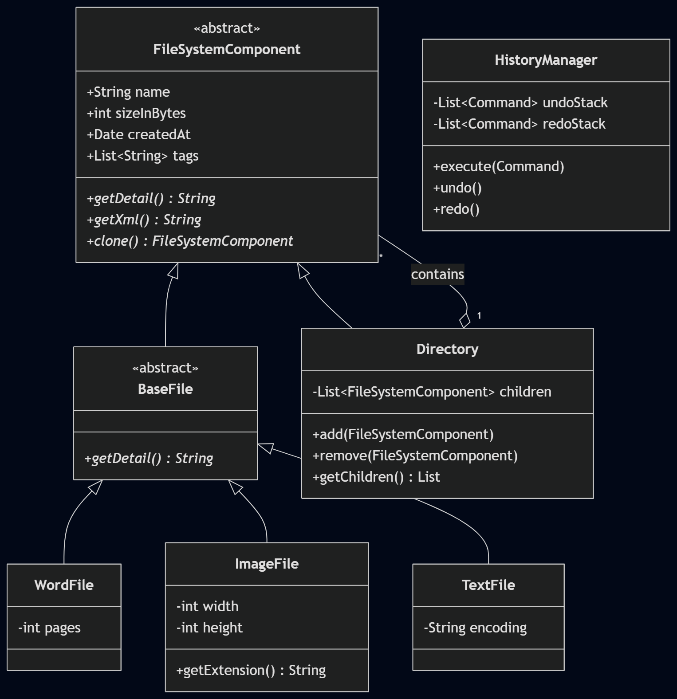
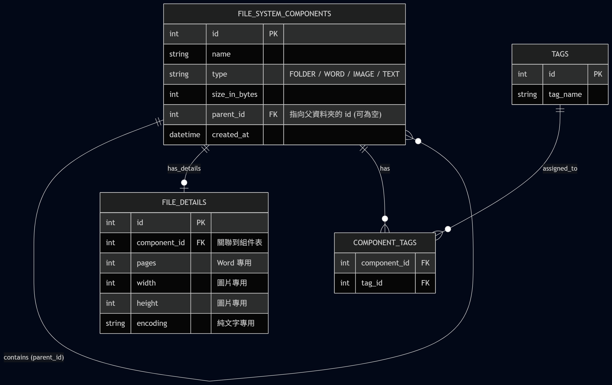

# 雲端檔案管理系統 (Cloud File Management System)

本專案為應徵者作業實作，基於客戶訪談需求，進行領域模型分析（Domain Modeling）並使用物件導向設計模式（Design Patterns）進行核心架構開發。

## 🛠 核心技術棧
- **Language:** Node.js (TypeScript)
- **Runner:** tsx
- **Architecture Tools:** Mermaid, OOP Design Patterns

---

## 📌 設計模式與架構特點

本系統完全遵循**單一職職責原則 (SRP)** 與**開放封閉原則 (OCP)**，並使用了以下三種經典設計模式：

1. **組合模式 (Composite Pattern)**
   - 將 `Directory`（資料夾）與各式 `File`（Word、圖片、純文字）抽象化為統一的 `FileSystemComponent` 基底。
   - 使得目錄內部可以無限層級地嵌套子目錄與檔案，達成靈活的樹狀結構管理。

2. **訪問者模式 (Visitor Pattern)**
   - 將「遞迴計算總容量」、「副檔名搜尋」與「XML 結構輸出」等核心商務邏輯，從檔案物件本身抽離至獨立的 `Visitor` 類別中。
   - 未來若需新增「匯出 JSON」或「權限檢查」功能，只需擴充新的 Visitor，**無需修改既有的檔案與資料夾程式碼**。

3. **命令模式 (Command Pattern) 與 原型模式 (Prototype Pattern)**
   - 進階實作了檔案的複製（Clone）與剪下功能。
   - 透過 `HistoryManager`（Command 歷史堆疊）完美支援了操作的 **Undo（復原）與 Redo（重做）** 機制。

---

## 📊 交付任務圖檔

### 1. 任務一：UML 類別圖 (Domain Model)
*(請將下載的 uml_diagram.png 放到專案中並在此處引用)*


### 2. 任務二：資料庫 Schema 設計 (ER Model)
*(請將下載的 erd_diagram.png 放到專案中並在此處引用)*


---

## 🏃‍♂️ 如何運行本專案

1. **安裝依賴套件：**
   ```bash
   npm install


## 輸出結果
============================================================
功能一：目錄結構呈現
============================================================
📁 根目錄 (Root)/ (共 2.7MB)
    📁 專案文件 (Project_Docs)/ (共 2.5MB)
        📄 需求規格書.docx (頁數: 15, 大小: 500KB)
        📄 系統架構圖.png (解析度: 1920x1080, 大小: 2MB)
    📁 個人筆記 (Personal_Notes)/ (共 201KB)
        📄 待辦清單.txt (編碼: UTF-8, 大小: 1KB)
        📁 2025備份 (Archive_2025)/ (共 200KB)
            📄 舊會議記錄.docx (頁數: 5, 大小: 200KB)
    📄 README.txt (編碼: ASCII, 大小: 500B)

============================================================
功能二-1：遞迴計算總容量（Root）
============================================================
Visiting: 根目錄 (Root)
Visiting: 根目錄 (Root) -> 專案文件 (Project_Docs)
Visiting: 根目錄 (Root) -> 專案文件 (Project_Docs) -> 需求規格書.docx
Visiting: 根目錄 (Root) -> 專案文件 (Project_Docs) -> 系統架構圖.png
Visiting: 根目錄 (Root) -> 個人筆記 (Personal_Notes)
Visiting: 根目錄 (Root) -> 個人筆記 (Personal_Notes) -> 待辦清單.txt
Visiting: 根目錄 (Root) -> 個人筆記 (Personal_Notes) -> 2025備份 (Archive_2025)
Visiting: 根目錄 (Root) -> 個人筆記 (Personal_Notes) -> 2025備份 (Archive_2025) -> 舊會議記錄.docx
Visiting: 根目錄 (Root) -> README.txt

>> 總容量：2.7MB

============================================================
功能二-1：遞迴計算總容量（個人筆記子目錄）
============================================================
Visiting: 個人筆記 (Personal_Notes)
Visiting: 個人筆記 (Personal_Notes) -> 待辦清單.txt
Visiting: 個人筆記 (Personal_Notes) -> 2025備份 (Archive_2025)
Visiting: 個人筆記 (Personal_Notes) -> 2025備份 (Archive_2025) -> 舊會議記錄.docx

>> 個人筆記總容量：201KB

============================================================
功能二-2：副檔名搜尋 (.docx)
============================================================
Visiting: 根目錄 (Root)
Visiting: 根目錄 (Root) -> 專案文件 (Project_Docs)
Visiting: 根目錄 (Root) -> 專案文件 (Project_Docs) -> 需求規格書.docx
Visiting: 根目錄 (Root) -> 專案文件 (Project_Docs) -> 系統架構圖.png
Visiting: 根目錄 (Root) -> 個人筆記 (Personal_Notes)
Visiting: 根目錄 (Root) -> 個人筆記 (Personal_Notes) -> 待辦清單.txt
Visiting: 根目錄 (Root) -> 個人筆記 (Personal_Notes) -> 2025備份 (Archive_2025)
Visiting: 根目錄 (Root) -> 個人筆記 (Personal_Notes) -> 2025備份 (Archive_2025) -> 舊會議記錄.docx
Visiting: 根目錄 (Root) -> README.txt

>> 搜尋結果：
   - 根目錄 (Root)/專案文件 (Project_Docs)/需求規格書.docx
   - 根目錄 (Root)/個人筆記 (Personal_Notes)/2025備份 (Archive_2025)/舊會議記錄.docx

============================================================
功能二-3：XML 結構輸出
============================================================
<根目錄_Root>
  <專案文件_Project_Docs>
    <需求規格書_docx>頁數: 15, 大小: 500KB</需求規格書_docx>
    <系統架構圖_png>解析度: 1920x1080, 大小: 2MB</系統架構圖_png>
  </專案文件_Project_Docs>
  <個人筆記_Personal_Notes>
    <待辦清單_txt>編碼: UTF-8, 大小: 1KB</待辦清單_txt>
    <2025備份_Archive_2025>
      <舊會議記錄_docx>頁數: 5, 大小: 200KB</舊會議記錄_docx>
    </2025備份_Archive_2025>
  </個人筆記_Personal_Notes>
  <README_txt>編碼: ASCII, 大小: 500B</README_txt>
</根目錄_Root>


============================================================
功能四-1：排序（依大小，降冪）
============================================================
📁 根目錄 (Root)/ (共 2.7MB)
    📁 專案文件 (Project_Docs)/ (共 2.5MB)
        📄 需求規格書.docx (頁數: 15, 大小: 500KB)
        📄 系統架構圖.png (解析度: 1920x1080, 大小: 2MB)
    📁 個人筆記 (Personal_Notes)/ (共 201KB)
        📄 待辦清單.txt (編碼: UTF-8, 大小: 1KB)
        📁 2025備份 (Archive_2025)/ (共 200KB)
            📄 舊會議記錄.docx (頁數: 5, 大小: 200KB)
    📄 README.txt (編碼: ASCII, 大小: 500B)

============================================================
功能四-3：標籤功能（多重標籤）
============================================================
[執行] 為 "README.txt" 加上標籤 [Urgent]
[執行] 為 "README.txt" 加上標籤 [Work]
📁 根目錄 (Root)/ (共 2.7MB)
    📁 專案文件 (Project_Docs)/ (共 2.5MB)
        📄 需求規格書.docx (頁數: 15, 大小: 500KB)
        📄 系統架構圖.png (解析度: 1920x1080, 大小: 2MB)
    📁 個人筆記 (Personal_Notes)/ (共 201KB)
        📄 待辦清單.txt (編碼: UTF-8, 大小: 1KB)
        📁 2025備份 (Archive_2025)/ (共 200KB)
            📄 舊會議記錄.docx (頁數: 5, 大小: 200KB)
    📄 README.txt (編碼: ASCII, 大小: 500B) [Urgent:Red][Work:Blue]

============================================================
功能四-2：編輯功能（刪除 + Undo / Redo）
============================================================
[執行] 刪除 "README.txt"

>> 刪除後：
📁 根目錄 (Root)/ (共 2.7MB)
    📁 專案文件 (Project_Docs)/ (共 2.5MB)
        📄 需求規格書.docx (頁數: 15, 大小: 500KB)
        📄 系統架構圖.png (解析度: 1920x1080, 大小: 2MB)
    📁 個人筆記 (Personal_Notes)/ (共 201KB)
        📄 待辦清單.txt (編碼: UTF-8, 大小: 1KB)
        📁 2025備份 (Archive_2025)/ (共 200KB)
            📄 舊會議記錄.docx (頁數: 5, 大小: 200KB)
[Undo] 已復原：刪除 "README.txt"

>> Undo 後（README.txt 應恢復）：
📁 根目錄 (Root)/ (共 2.7MB)
    📁 專案文件 (Project_Docs)/ (共 2.5MB)
        📄 需求規格書.docx (頁數: 15, 大小: 500KB)
        📄 系統架構圖.png (解析度: 1920x1080, 大小: 2MB)
    📁 個人筆記 (Personal_Notes)/ (共 201KB)
        📄 待辦清單.txt (編碼: UTF-8, 大小: 1KB)
        📁 2025備份 (Archive_2025)/ (共 200KB)
            📄 舊會議記錄.docx (頁數: 5, 大小: 200KB)
    📄 README.txt (編碼: ASCII, 大小: 500B) [Urgent:Red][Work:Blue]
[Redo] 已重做：刪除 "README.txt"

>> Redo 後（README.txt 應再次消失）：
📁 根目錄 (Root)/ (共 2.7MB)
    📁 專案文件 (Project_Docs)/ (共 2.5MB)
        📄 需求規格書.docx (頁數: 15, 大小: 500KB)
        📄 系統架構圖.png (解析度: 1920x1080, 大小: 2MB)
    📁 個人筆記 (Personal_Notes)/ (共 201KB)
        📄 待辦清單.txt (編碼: UTF-8, 大小: 1KB)
        📁 2025備份 (Archive_2025)/ (共 200KB)
            📄 舊會議記錄.docx (頁數: 5, 大小: 200KB)

============================================================
功能四-2：編輯功能（複製 / 貼上）
============================================================
[執行] 貼上 "專案文件 (Project_Docs)_copy" 至 "個人筆記 (Personal_Notes)"

>> 貼上後（Personal_Notes 底下應多一份 Project_Docs 副本）：
📁 根目錄 (Root)/ (共 5.2MB)
    📁 專案文件 (Project_Docs)/ (共 2.5MB)
        📄 需求規格書.docx (頁數: 15, 大小: 500KB)
        📄 系統架構圖.png (解析度: 1920x1080, 大小: 2MB)
    📁 個人筆記 (Personal_Notes)/ (共 2.7MB)
        📄 待辦清單.txt (編碼: UTF-8, 大小: 1KB)
        📁 2025備份 (Archive_2025)/ (共 200KB)
            📄 舊會議記錄.docx (頁數: 5, 大小: 200KB)
        📁 專案文件 (Project_Docs)_copy/ (共 2.5MB)
            📄 需求規格書.docx (頁數: 15, 大小: 500KB)
            📄 系統架構圖.png (解析度: 1920x1080, 大小: 2MB)
[Undo] 已復原：貼上 "專案文件 (Project_Docs)_copy" 至 "個人筆記 (Personal_Notes)"

>> Undo 貼上後：
📁 根目錄 (Root)/ (共 2.7MB)
    📁 專案文件 (Project_Docs)/ (共 2.5MB)
        📄 需求規格書.docx (頁數: 15, 大小: 500KB)
        📄 系統架構圖.png (解析度: 1920x1080, 大小: 2MB)
    📁 個人筆記 (Personal_Notes)/ (共 201KB)
        📄 待辦清單.txt (編碼: UTF-8, 大小: 1KB)
        📁 2025備份 (Archive_2025)/ (共 200KB)
            📄 舊會議記錄.docx (頁數: 5, 大小: 200KB)